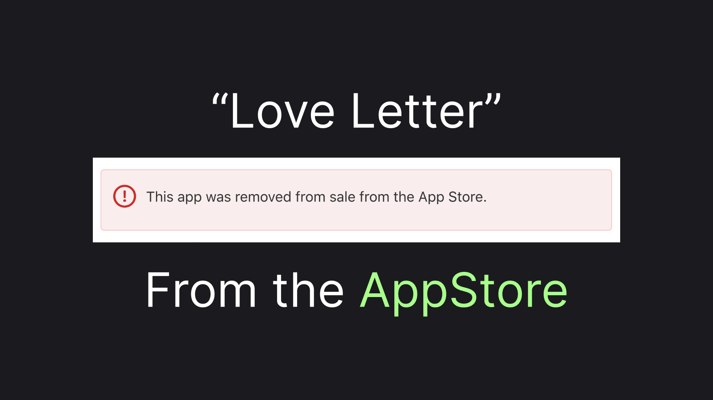
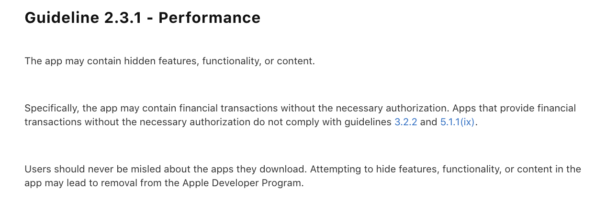
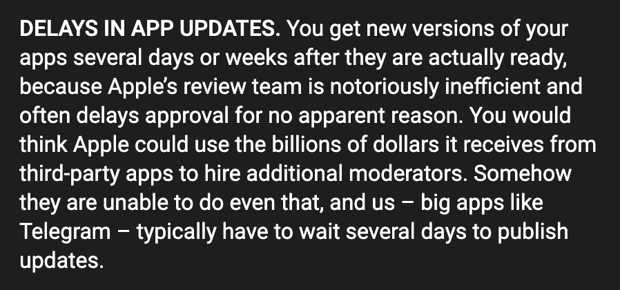
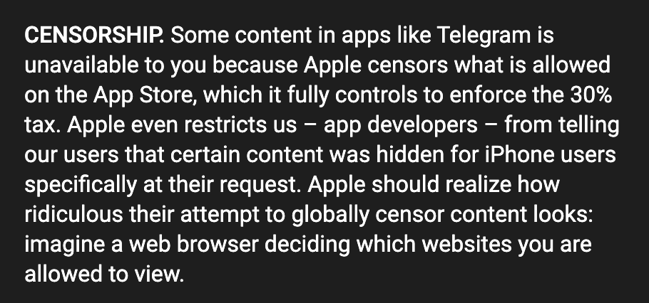
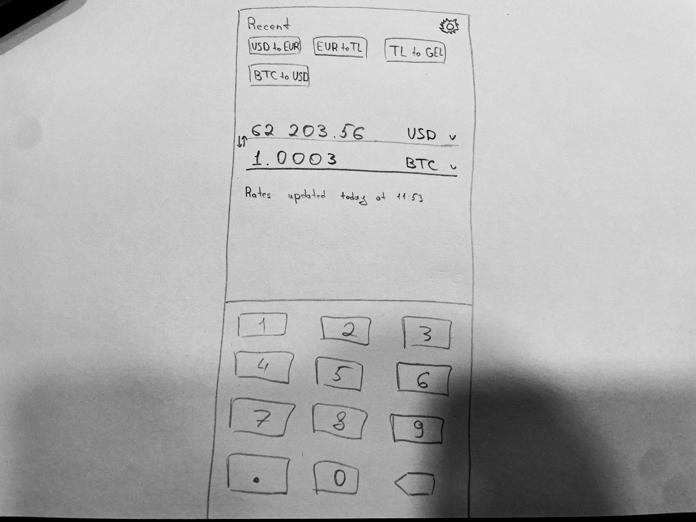

# I Got Kicked Out Of the AppStore. Now What?

"This app was removed from sale from the App Store.". This message popped up in my face in AppStore Connect recently. Communication message "elaborated" that my app "have engaged in concept or feature switch schemes to evade the review process". I've spent last week trying to get something more specific, but with no luck, yet. Let's discuss what I make out of this situation!

## The Issue In-Depth

It all started during the review of yet another app version. The review was rejected with the following message:

I've sent a response to the Apple team, highlighting that there's no such functionality in the app. I did it more than a week ago, but I'm yet to receive an answer. Two days after the rejection, I found the message stating the fact that my app was removed from the app store completely! I've submitted appeals for that decision, but again, I'm yet to hear anything back.

The way Apple communicates about the issue is very disappointing. I've already described how unnecessarily troubling my AppStore journey was in the [previous article](https://medium.com/@vosarat1995/releasing-a-flutter-ios-app-my-appstore-story-bdf933a57e17), and now it's getting even more upsetting. My app is developed using Flutter, so it's cross-platform in principle, but I decided to focus on the iOS app at the beginning of my app growth and now I have grown to regret that decision wholeheartedly.

In [another article](https://medium.com/@vosarat1995/how-i-started-my-3-year-software-development-side-hustle-f4aae0fc3cad) about this project, I've mentioned that it originally was intended to be a telegram bot, but later on, I've decided that bots just don't have enough audience. However now, with the development of telegram mini apps, I see more and more people switching to that technology. And with the experience of terrible relationships with Apple, I start to feel more and more sympathy towards Telegram's CEO Pavel Durov long long-running battle with Apple's monopoly-like behaviour towards app developers. 

> I gathered a few links to Pavel's posts on that matter. Unfortunately, I could find the most detailed [article](https://te.legra.ph/Kak-Apple-unichtozhaet-startapy-po-vsemu-miru--i-kak-ehto-mozhno-ostanovit-07-09) only in Russian, but there's a great [post](https://t.me/durov/122) in English, too. Here are the highlights of two points, most relative to our discussions:

## Possible Solution

With the incident going on I'm starting to revise my decision of an iOS-first approach. Even before the incident, I experienced a problem, that with Apple reviews I was not really in control of the release schedule. So although I can't yet say if the Google Play review team works better I would like to make the first target platform permissionless, to stay in control of the release schedule. Therefore, I'm going to switch the primary target platform to the web, with a progressive web app or PWA. And here's my completed and ordered list of target platforms:

- Progressive Web App
- Telegram Mini App and Bot
- Android App
- iOS App (Maybe).
- Chrome Extension.

Beyond reranking the targets, I also want the app now to be truly cross-platform, which includes the following functional requirements:

- Offline Support
- User data synchronized across the apps

As you may imagine restructuring a high-volume existing app for the new targets list and cross-platform support is a complicated task. So instead I've decided to do something different!

## The New App

I got the rejection letter when I started to implement the currency conversion feature in the Finrir app. Currency conversion is a relatively simple yet popular need. So I've decided to build a mini app around it, here's a markup of the app:

I intend to build a simple converter, with cryptocurrencies rates included. I want to store and sync users recently used conversions among apps on different platforms. We'll see how the idea works out, at least that functionality should be part of the Finrir app anyway.

> I'm trying to limit myself with the times I jump from one new shiny project to another. But you may see I'm not very good at it - well, at least this time it's not something **totally** new 😁

## Recap

I've picked iOS as the only target platform for my app's initial growth stage. That decision has already started to bite me. Now I want to experiment with a web-first targeting approach, making a sub-app of my main expense-tracking application, Finrir. If you are interested in the development progress please clap to this article and consider subscribing 👉👈
