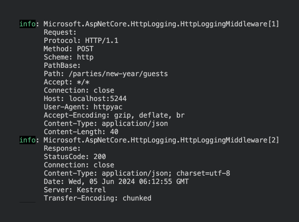
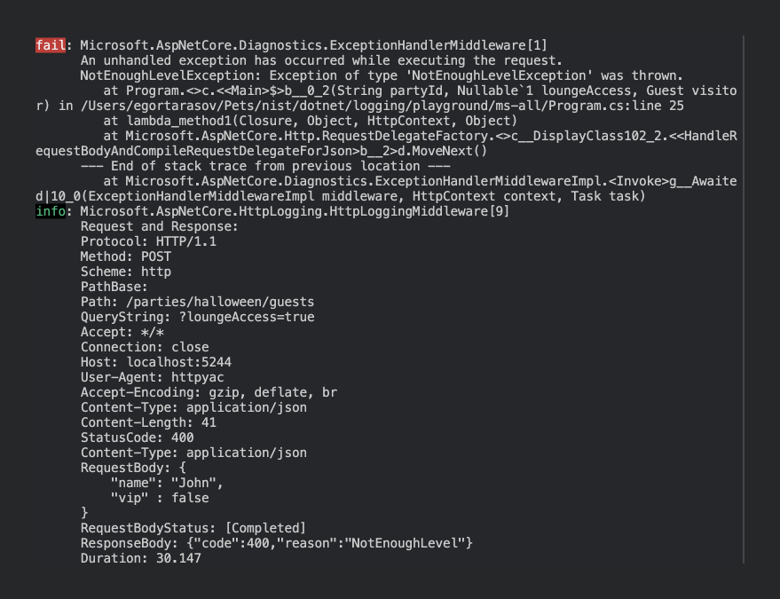
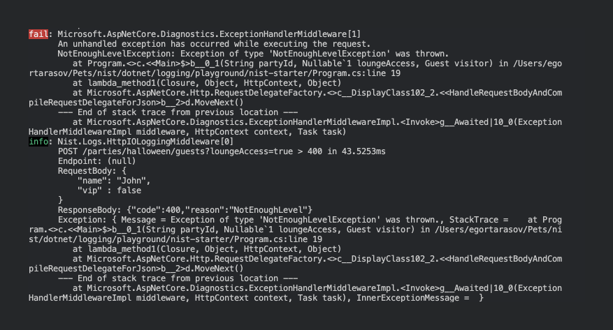

# Request-Response Logging in ASP .NET Core

Logging ASP .NET Core http requests and responses is a common task almost every .NET developer faces sooner or later. For a long time, the most popular approach development teams chose seemed to be writing a custom middleware. But Since .NET 6 we get a Microsoft.AspNetCore.HttpLogging library built-in.  So, dear .NET beavers, let's check out the logs Microsoft gave us! ~~And find a better ones~~


## Setting up the logging

We'll start with the most minimal setup .NET provides to us, by running

```sh
dotnet new web
```

It's important to check the logging of every part of an http request e.g. request body, query string, errors, and path parameters. So the default `Hello World` endpoint won't do. Let's instead create a party with ~blackjack~ query and route parameters:

```csharp
app.MapPost("/parties/{partyId}/guests", (string partyId, [FromQuery] bool? loungeAccess, Guest visitor) => {
    if (loungeAccess == true && !visitor.Vip) 
        throw new NotEnoughLevelException();

    return new Ticket(
        PartyId: partyId,
        Receiver: visitor.Name,
        LoungeAccess: loungeAccess ?? false,
        Code: Guid.NewGuid().ToString()
    );
});

app.Run();

public record Guest(string Name, bool Vip);
public record Ticket(string PartyId, string Receiver, bool LoungeAccess, string Code);
public class NotEnoughLevelException : Exception;
```

By default for `NotEnoughLevelException` ASP .NET Core will roughly interrupt the request and return `InternalServerError`. Let's create an error object instead. Probably the easiest way to achieve it is by using the `Nist.Errors` nuget package. To install it we'll use the following command

```shell
dotnet add package Nist.Errors
```

And map our exception to the corresponding errors:

```csharp
app.UseErrorBody<Error>(ex => ex switch {
    NotEnoughLevelException _ => new (HttpStatusCode.BadRequest, "NotEnoughLevel"),
    _ => new (HttpStatusCode.InternalServerError, "Unknown")
}, showException: false);
```

Now, let's get to the request and response logging. The most minimalistic way to enable it consists of 4 steps:

1. Register http logging services

```csharp
builder.Services.AddHttpLogging(o => {});
```

2. Attach the http logging middleware

```csharp
app.UseHttpLogging();
```

3. Remove `appsettings.Development.json` to minimize our configuration overhead
4. Since, by default, the log level of `Microsoft.AspNetCore` is `Warning` specify a dedicated log level for the http logging middleware in `appsettings.json`:

```json
"Microsoft.AspNetCore.HttpLogging.HttpLoggingMiddleware": "Information"
```

After all those changes here's what our complete `Program.cs` will look like:

```csharp
using Microsoft.AspNetCore.Mvc;
using Nist.Errors;
using System.Net;

var builder = WebApplication.CreateBuilder(args);

builder.Services.AddHttpLogging(o => {});

var app = builder.Build();

app.UseHttpLogging();

app.UseErrorBody<Error>(ex => ex switch {
    NotEnoughLevelException _ => new (HttpStatusCode.BadRequest, "NotEnoughLevel"),
    _ => new (HttpStatusCode.InternalServerError, "Unknown")
}, showException: false);

app.MapPost("/parties/{partyId}/guests", (string partyId, [FromQuery] bool? loungeAccess, Guest visitor) => {
    if (loungeAccess == true && !visitor.Vip) 
        throw new NotEnoughLevelException();

    return new Ticket(
        PartyId: partyId,
        Receiver: visitor.Name,
        LoungeAccess: loungeAccess ?? false,
        Code: Guid.NewGuid().ToString()
    );
});

app.Run();

public record Guest(string Name, bool Vip);
public record Ticket(string PartyId, string Receiver, bool LoungeAccess, string Code);
public class NotEnoughLevelException : Exception;
```

Let's test it out, starting with a normal request:

```http
POST http://localhost:5244/parties/new-year/guests?loungeAccess=true

{
    "name": "Paul",
    "vip" : true
}
```

Here are the logs we get:



Now let's move to a "bad" request. 

```http
POST http://localhost:5244/parties/halloween/guests?loungeAccess=true

{
    "name": "John",
    "vip" : false
}
```

We'll get:


## Configuring the logging

As you may see, although we have a lot of things logged we can't really say much about the request. We may figure out which endpoint was hit and whether our response was successful (if we use http status codes), but that's about it. Plus, in a high-load environment matching requests and responses could be a challenge since they are logged separately. So let's `CombineLogs` and see what we __can__ get logged. Here's the code:

```csharp
builder.Services.AddHttpLogging(o => {
    o.CombineLogs = true;

    o.LoggingFields = HttpLoggingFields.All | HttpLoggingFields.RequestQuery;
});
```

> `HttpLoggingFields.All` is sort of a lie, and it specifies so in the logs: "HttpRequest.QueryString is not included with this flag as it may contain private information". So we'll need to attach RequestQuery manually

This is what we get now:




That's much better, now we can see what exactly was received, responded, and how much time did processing took. However, the log still feels overwhelming - we log a lot of headers, which doesn't seem to bring any value. Let's leave just the thing we need:

```csharp
builder.Services.AddHttpLogging(o => {
    o.CombineLogs = true;

    o.LoggingFields = HttpLoggingFields.RequestQuery
        | HttpLoggingFields.RequestMethod
        | HttpLoggingFields.RequestPath
        | HttpLoggingFields.RequestBody
        | HttpLoggingFields.ResponseStatusCode
        | HttpLoggingFields.ResponseBody
        | HttpLoggingFields.Duration;
});
```

Now, we'll get practically the same amount of useful information in a much more compact format:


## Making it even better

There are still some problems with what we have, however:

1. Note that because we have the path variable `partyId` the value of the `path` field is not the same for a single endpoint. That will prevent us from getting analytics by a specific endpoint.
2. There's no connection between the request-response log and the log of an occurred exception. Which can make it complicated to find the exact exception for an unsuccessful response. Especially, when the exception is unrecognized.
3. The log still takes up a lot of space due to a number of reasons. First, we have useless unremovable fields (`RequestBodyStatus`, `PathBase`). Secondly, we have a very "wide" format, using in total of 4 rows for method, path, and query string.

Fortunately, we have a nuget package that covers the blind spots in the built-in library. Let's check it out. First, we'll need to install it:

```shell
dotnet add package Nist.Logging
```

And then change just 3 lines:

```csharp
using Nist.Logs;

// remove builder.Services.AddHttpLogging

app.UseHttpIOLogging(); // instead of app.UseHttpLogging();
```

And we got minimal, yet fully-functioning logs:




> Although, `ExceptionHandlerMiddleware` still logs an occurred exception we no longer need to rely on it since we have an exception logged in the logging middleware. You can even silence the `ExceptionHandlerMiddleware` with `"Microsoft.AspNetCore.Diagnostics.ExceptionHandlerMiddleware": "None"` in the `appsettings.json`

## Recap

To wrap things up, let's take a look at the best request-response logging we were able to get:


Although `Microsoft.AspNetCore` since .NET 6 provides an extensive http logging functionality out-of-the-box, there are still a few missing features. So instead we've used the `Nist.Logs` nuget package. Here's the table summarizing the feature list of the libraries:

```
| Feature            | Microsoft.AspNetCore.HttpLogging     | Nist.Logs |
|--------------------|--------------------------------------|-----------|
| Full Uri           | ❌ - Only Path and Query Separately   | ✅         |
| Minimalism         | ❌ - Few unremovable redundant fields | ✅         |
| Exception attached | ❌                                    | ✅         |
| Endpoint id        | ❌                                    | ✅         |
| Single Line        | ✅                                    | ✅         |
| Http Method        | ✅                                    | ✅         |
| Request Body       | ✅                                    | ✅         |
| Response Body      | ✅                                    | ✅         |
| Response Code      | ✅                                    | ✅         |
| Request Duration   | ✅                                    | ✅         |
```

And for a quick reference here's the final `Program.cs`:

```csharp
using Microsoft.AspNetCore.Mvc;
using Nist.Logs;
using Nist.Errors;
using System.Net;

var builder = WebApplication.CreateBuilder(args);

var app = builder.Build();

app.UseHttpIOLogging();

app.UseErrorBody<Error>(ex => ex switch {
    NotEnoughLevelException _ => new (HttpStatusCode.BadRequest, "NotEnoughLevel"),
    _ => new (HttpStatusCode.InternalServerError, "Unknown")
}, showException: false);

app.MapPost("/parties/{partyId}/guests", (string partyId, [FromQuery] bool? loungeAccess, Guest visitor) => {
    if (loungeAccess == true && !visitor.Vip) 
        throw new NotEnoughLevelException();

    return new Ticket(
        PartyId: partyId,
        Receiver: visitor.Name,
        LoungeAccess: loungeAccess ?? false,
        Code: Guid.NewGuid().ToString()
    );
});

app.Run();

public record Guest(string Name, bool Vip);
public record Ticket(string PartyId, string Receiver, bool LoungeAccess, string Code);
public class NotEnoughLevelException : Exception;
```

You can also find the full [project](https://github.com/astorDev/nist/tree/main/dotnet/logging/playground/nist-starter) on the github.
