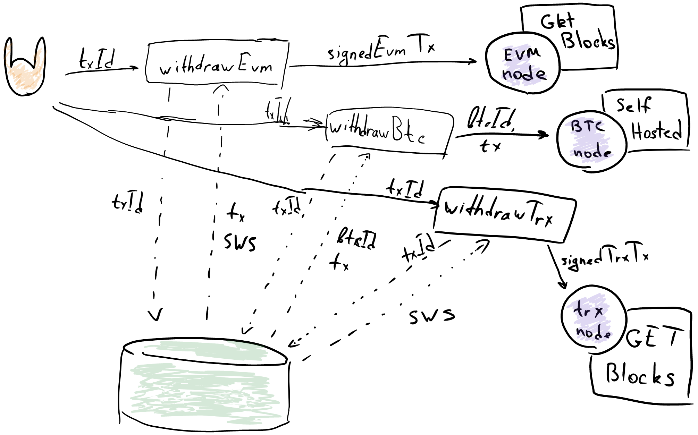
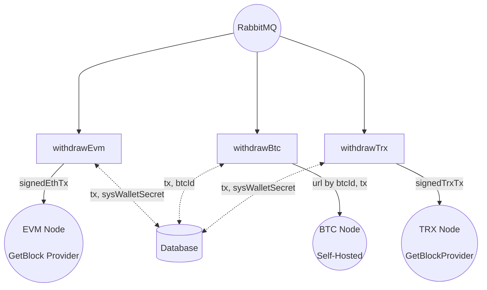
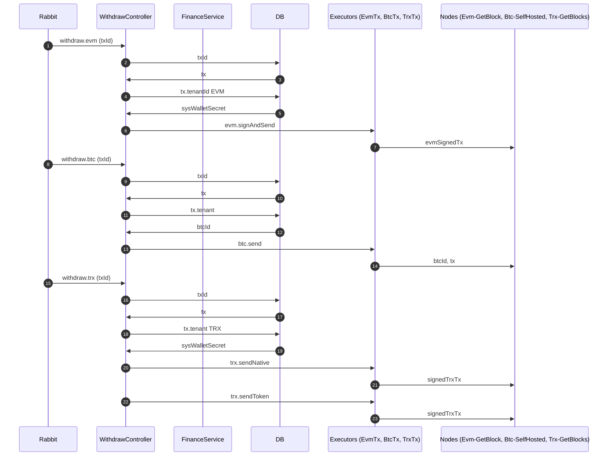

# Code documentation: Drawings VS Pseudo-Code VS Bulletpoints VS Mermaid

I'm frequently faced with the challenge of documenting an existing system. But I never figured out what tool is the most effective, so, most of the times, I randomly pick a tool and just go with it. This time, I decided to conduct a small competition. 

This is what the competing tools were challenged to describe:

> `WithdrawalController` subscribed to RabbitMQ queues `withdraw.evm`, `withdraw.btc` and `withdraw.trx` with methods `WithdrawEvm`, `WithdrawBtc`, `WithdrawTrx`. Each of these queues message contains single field `txId`.
>
> `WithdrawEvm` first reads `tx` from the database by the `txId`, then reads `sysWalletSecret` from the database by `tx.TenantId`. `tx` and `sysWalletSecret` are then passed to `EvmTxManager.SignAndSend`, which constructs signed evm tx and sends it via `JsonRpc eth_sendRawTransaction` request to evm node provided by the `GetBlock`.
>
> `WithdrawBtc` reads from the database first `tx` by the `txId`, then `btcId` 
by `tx.TenantId`. `tx` and `btcId` are then passed to `BtcTxManager.Send` which constructs self-hosted btc node url using btcId and sends there `JsonRpc sendtoaddress` request build with data from `tx`
>
> `WithdrawTrx` reads from the database first `tx` by the `txId`, then `sysWalletSecret` by `tx.TenantId`. Then based on whether `tx.Type` is equal to "Native" calls either `TrxTxManager.sendNative` or `TrxTxManager.sendToken` with `tx` and `sysWalletSecret`. Both `TrxTxManager` methods send `POST wallet/broadcasttransaction` request with constructed signed trx tx to the trx node provided by the `GetBlock`

And here's what I got:

## Hand Drawing



## Preudo Code

```ruby
WithdrawalController
    withdrawEvm rabbitQueue("withdraw.evm")
        tx = db.txBy @txId
        sysWalletSecret = db.sysWalletSecretFor 'EVM' tx.TenantId
        EvmTxManager.signAndSend tx sysWalletSecret      

    withdrawBtc rabbitQueue("withdraw.btc")
        tx = db.transactionBy @txId
        btcId = db.btcIdBy transaction.TenantId
        BtcTxManager.send tx btcId

    withdrawTrx rabbitQueue("withdraw.trx")
        tx = db.txBy @txId
        sysWalletSecret = db.sysWalletSecretFor 'TRX' tx.TenantId
        
        if tx.Type == "Native"
            TrxTxManager.sendNative
                tx
                sysWalletSecret
        else
            TrxTxManager.sendToken
                tx
                sysWalletSecret

EvmTxManager
    signAndSend
        signedEvmTx = signedTxFrom @tx @secret
        sendJsonRpc getblock.evmNode "eth_sendRawTransaction" signedEvmTx

BtcTxManager
    send
        sendJsonRpc 
            selfhosted.btcNode 
                @btcId
            "sendtoaddress"
            @tx

TrxTxManager
    sendNative
        signedTrxTx = signedTxFrom @tx @secret
        post getBlock.trxNode "/wallet/broadcasttransaction" signedTransaction

    sendToken
        signedTransaction = signedTxFrom @tx @secret
        post getBlock.trxNode "/wallet/broadcasttransaction" signedTransaction
```

## Bulletpoints

- `WithdrawController` handles messages from `RabbitMQ`
    - `withdraw.evm` (`WithdrawEvm`)
        - SELECTS `tx` by `txId`
        - SELECTS `sysWalletSecret` by `transaction.TenantId`
        - Sends to `EvmTxManager.signAndSend`
            - Creates `signedEvmTx` 
            - Sends a `JsonRpc` request `eth_sendRawTransacton` to `evmNode` from `GetBlock` provider.
    - `withdraw.btc` (`WithdrawBtc`)
        - SELECTS `tx` by `txId`
        - SELECTS `sysWalletSecret` by `tx.TenantId`
        - Sends to `BtcTxManager.send`
            - Constructs `self-hosted` `btcNode` url using `btcId`
            - Sends a `JsonRpc` request `sendtoaddress` to the url
    - `withdraw.trx` (`WithdrawTrx`)
        - SELECTS `tx` by `txId`
        - SELECTS `sysWalletSecret` by `transaction.TenantId`
        - Calls `TrxTxManager` `sendToken` and `sendNative` based on `transaction.Type`
            - Creates `signedTrxTx` for both native and custom tokens.
            - Sends it via `POST wallet/broadcasttransaction` to `trxNode` from `GetBlock` provider

## Mermaid Flowchart



## Mermaid Sequence Diagram



# Results

If I'd have to pick a solo winner that would be **bullet points**.

Writing bullet points was intuitive and fast. Any specialist can understand them. Their tree-like structure, perfectly match the flow of the process, allowing step-by-step investigation of each proccess branch. Finally, they are perfectly git-friendly: can be read with no additional tooling, easy to comment on, and so on. 

Paradoxically enough, this is the least fancy tool. To glamorize that a bird-eye mermaid flow chart can be added to the mix. I assume a combination of those two would be the most beautiful and understandable way to create a documentation for an existing code.