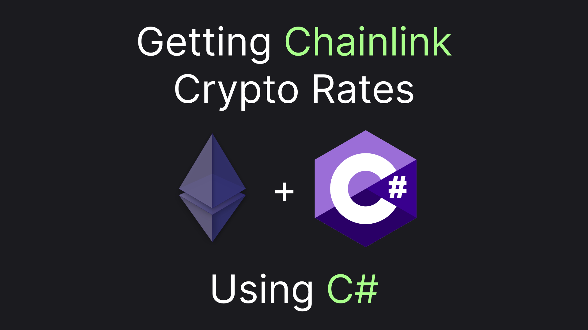
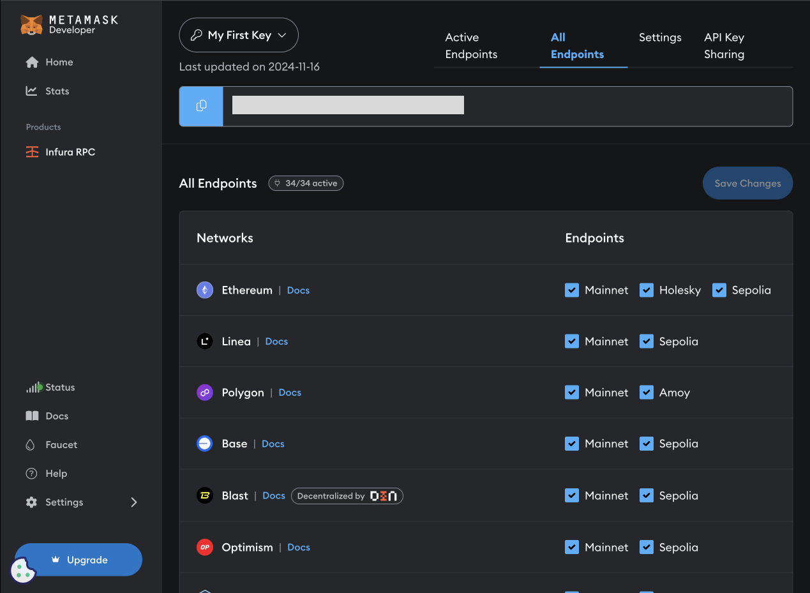

# Web3 With C#: A Practical Example

Reading Bitcoin price from an ethereum smart contract using C# - this is what we are going to do in this article. This should give us a solid foundation for working with web3 in C#, so let's get going!



## Getting a Node

To call a smart contract we need a node. As you may know, ethereum nodes require a significant amount of resources. Gladly, [infura](https://www.infura.io/) provides a free node after registration. After signing up you should end up in a Metamask Developer UI, with your Infura RPC in a product section:



Most importantly, there's also an API KEY, which you can use to send requests. Ethereum uses JSON RPC for its requests and responses so you will always use a single url, which will look like this `https://mainnet.infura.io/v3/{API_KEY}` and send a `POST` request to it. Let's make sure everything works by sending the following request body to the endpoint:

```json
{
  "jsonrpc": "2.0",
  "method": "eth_blockNumber",
  "id": 1
}
```

If everything is done correctly the node should respond with the current block number in a hex notation. Something like this:

```json
{
  "jsonrpc": "2.0",
  "id": 1,
  "result": "0x143af09"
}
```

That's about it for our infrastructure setup. Now, let's find out which contract we should call to get the current BTC price and how we can do it.

## Calling the Contract

To get our rates we will use the Chainlink Price Feed contract. Searching BTC/USD price contract address in the [Chainlink Reference Page](https://docs.chain.link/data-feeds/price-feeds/addresses?network=ethereum&page=1&search=BTC%2FUSD) will give us `0xF4030086522a5bEEa4988F8cA5B36dbC97BeE88c`.

The next thing we need to do is to specify which contract function we need to call. The method is called `latestRoundData()`, according to chainlink documentation. To specify it we will need to get the first 8 chars of [Keccak-256](https://pi7.org/hash/keccak-256) hash from the call (`latestRoundData()`), prepended with the hex indicator (`0x`). This will give us the following call data: `0xfeaf968c`

Assembling it all together and using the Ethereum RPC method for contract calls (`eth_call`) we will get the following request:

```json
{
  "jsonrpc": "2.0",
  "method": "eth_call",
  "params": [
    {
      "to": "0xF4030086522a5bEEa4988F8cA5B36dbC97BeE88c",
      "data": "0xfeaf968c"
    },
    "latest"
  ],
  "id": 1
}
```

By sending the request we should get a response resembling the one below:

```json
{
  "jsonrpc": "2.0",
  "id": 1,
  "result": "0x00000000000000000000000000000000000000000000000700000000000007e90000000000000000000000000000000000000000000000000000085f0e031b8000000000000000000000000000000000000000000000000000000000673ae5f200000000000000000000000000000000000000000000000000000000673ae60700000000000000000000000000000000000000000000000700000000000007e9"
}
```

How can we comprehend the result? We'll the result is combined from a few output parameters each occupying 64 hex symbols. This is what we'll get if we extract `0x` and split the result in a 64-symbol length string.

```
0x
00000000000000000000000000000000000000000000000700000000000007e9
0000000000000000000000000000000000000000000000000000085f0e031b80
00000000000000000000000000000000000000000000000000000000673ae5f2
00000000000000000000000000000000000000000000000000000000673ae607
00000000000000000000000000000000000000000000000700000000000007e9
```

From Chainlink contract documentation we know that the second parameter in the result is the price we are looking for. So if we supply the second row (effectively `85F0E031B80`) to [hex to decimal converter](https://www.binaryhexconverter.com/hex-to-decimal-converter) we will get the following number `9204350000000`. Now all that's left is to divide the number by 10^8. Chainlink multiplies 10^8 to get a price, that can be expressed in a whole number. So, `9204350000000 / 100_000_000 = 92043.5`, which is the price of Bitcoin at the time of writing.

With the understanding of how we can actually get the price from the contract, let's move further - to the C# code!

## Defining ABI in C#

As you may see from the previous section to comprehend a contract response we need to decode bytes from the `result` field. This is a rather tricky and low-level activity. To make it slightly less painful ethereum has a concept of ABI (Application Binary Interface), which is basically a description of a contract, including its functions, its input, and output model.

Let's create a class `LatestRoundDataContract` that will help us work with the contract. We will define the ABI in its standard JSON form, here's how:

```csharp
public const string Abi = """
                          [{
                              "constant": true,
                              "inputs": [],
                              "name": "latestRoundData",
                              "outputs": [
                                  { "name": "roundId", "type": "uint80" },
                                  { "name": "answer", "type": "int256" },
                                  { "name": "startedAt", "type": "uint256" },
                                  { "name": "updatedAt", "type": "uint256" },
                                  { "name": "answeredInRound", "type": "uint80" }
                              ],
                              "payable": false,
                              "stateMutability": "view",
                              "type": "function"
                          }]
                          """;
```

Defining the contract will help our ethereum client library to call ethereum smart contracts in a more strongly-typed fashion. Our next step is to provide an output model, which our library will be able to serialize. 

First, we need to install the library

```sh
dotnet add package Nethereum.Web3
```

And now use its attributes to get our output model ready.

```csharp
[FunctionOutput]
public record Output
{
    [Parameter("uint80", "roundId", 1)]
    public BigInteger RoundId { get; set; }

    [Parameter("int256", "answer", 2)]
    public BigInteger Answer { get; set; }

    [Parameter("uint256", "startedAt", 3)]
    public BigInteger StartedAt { get; set; }

    [Parameter("uint256", "updatedAt", 4)]
    public BigInteger UpdatedAt { get; set; }

    [Parameter("uint80", "answeredInRound", 5)]
    public BigInteger AnsweredInRound { get; set; }
}
```

Let's also specify contract addresses for different prices:

```csharp
public class Addresses
{
    public const string BtcUsd = "0xF4030086522a5bEEa4988F8cA5B36dbC97BeE88c";
    public const string SolUsd = "0x4ffC43a60e009B551865A93d232E33Fce9f01507";
    public const string UsdtUsd = "0x3E7d1eAB13ad0104d2750B8863b489D65364e32D";
}
```

As you may see from the `Output` model we use `BigInteger` for all the data types due to the limited ethereum type system. Gladly, we have a much more robust type-system in C# so let's provide a mapping from the raw output to a normalized one:

```csharp
public record NormalizedOutput(
    UInt128 RoundId,
    decimal Answer,
    DateTime StartedAt,
    DateTime UpdatedAt
)
{
    public static NormalizedOutput From(Output raw)
    {
        return new(
            Answer: (decimal)raw.Answer / 100_000_000,
            StartedAt : LocalDateTimeFrom(raw.StartedAt),
            UpdatedAt: LocalDateTimeFrom(raw.UpdatedAt),
            RoundId: (UInt128)raw.RoundId
        );
    }

    public static DateTime LocalDateTimeFrom(BigInteger value) => DateTimeOffset.FromUnixTimeSeconds((long)value).LocalDateTime;
}

[FunctionOutput]
public record Output
{
    // The same properties as before

    public NormalizedOutput Normalize() => NormalizedOutput.From(this);
}
```

With the model in place, we are finally ready to move to the fun part of actually calling the contract from our C# code.

## Getting the Rates

Here's the full `LatestRoundDataContract` code just for reference:

```csharp
public class LatestRoundDataContract
{
    public const string Abi = """
                              [{
                                  "constant": true,
                                  "inputs": [],
                                  "name": "latestRoundData",
                                  "outputs": [
                                      { "name": "roundId", "type": "uint80" },
                                      { "name": "answer", "type": "int256" },
                                      { "name": "startedAt", "type": "uint256" },
                                      { "name": "updatedAt", "type": "uint256" },
                                      { "name": "answeredInRound", "type": "uint80" }
                                  ],
                                  "payable": false,
                                  "stateMutability": "view",
                                  "type": "function"
                              }]
                              """;

    public class Addresses
    {
        public const string BtcUsd = "0xF4030086522a5bEEa4988F8cA5B36dbC97BeE88c";
        public const string SolUsd = "0x4ffC43a60e009B551865A93d232E33Fce9f01507";
        public const string UsdtUsd = "0x3E7d1eAB13ad0104d2750B8863b489D65364e32D";
    }
    
    [FunctionOutput]
    public record Output
    {
        [Parameter("uint80", "roundId", 1)]
        public BigInteger RoundId { get; set; }

        [Parameter("int256", "answer", 2)]
        public BigInteger Answer { get; set; }

        [Parameter("uint256", "startedAt", 3)]
        public BigInteger StartedAt { get; set; }

        [Parameter("uint256", "updatedAt", 4)]
        public BigInteger UpdatedAt { get; set; }
    
        [Parameter("uint80", "answeredInRound", 5)]
        public BigInteger AnsweredInRound { get; set; }
        
        public NormalizedOutput Normalize() => NormalizedOutput.From(this);
    }

    public record NormalizedOutput(
        UInt128 RoundId,
        decimal Answer,
        DateTime StartedAt,
        DateTime UpdatedAt
    )
    {
        public static NormalizedOutput From(Output raw)
        {
            return new(
                Answer: (decimal)raw.Answer / 100_000_000,
                StartedAt : LocalDateTimeFrom(raw.StartedAt),
                UpdatedAt: LocalDateTimeFrom(raw.UpdatedAt),
                RoundId: (UInt128)raw.RoundId
            );
        }

        public static DateTime LocalDateTimeFrom(BigInteger value) => DateTimeOffset.FromUnixTimeSeconds((long)value).LocalDateTime;
    }
}
```

With the model, we will be able to write a code to get the rate. The plan is simple: 

1. Connect to web3 via our Infura node
2. Resolve the contract model using the ABI string and BTC/USD contract address
3. Extract the function from the contract model we've just prepared
4. Call the function
5. Deserialize the result into a raw output model
6. Map the result into our final model

And here's the code that does just that:

```csharp
var web3 = new Web3("https://mainnet.infura.io/v3/{YourInfuraApiKey}");

var contract = web3.Eth.GetContract(LatestRoundDataContract.Abi, LatestRoundDataContract.Addresses.BtcUsd);
        
var function = contract.GetFunction("latestRoundData") ?? throw new("Function latestRoundData not found");
        
var output = await function.CallDeserializingToObjectAsync<LatestRoundDataContract.Output>();
        
Console.WriteLine(output.Normalize());
```

Here's an example of a result we may have received:

```js
NormalizedOutput { RoundId = 129127208515966863337, Answer = 92043,5, StartedAt = 18.11.2024 11:00:02, UpdatedAt = 18.11.2024 11:00:23 }
```

In the result we can see an `Answer` with the price of Bitcoin at the time of writing. Hooray!

## Recap

We've figured out how we can use the C# Nethereum client to get cryptocurrency rates. We were able to do this for free with the help of Chainlink Price Feed. 

> Well, for free excluding the potential costs of running an ethereum node.

The article should also give you a basic understanding of what web3 is about from the technical perspective. And hey, if you find the article helpful ... claps are appreciated! 👏
