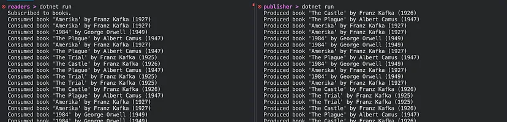
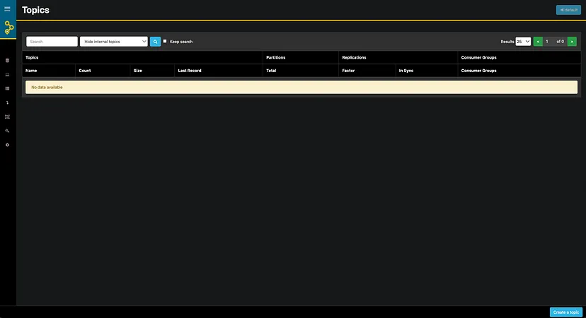
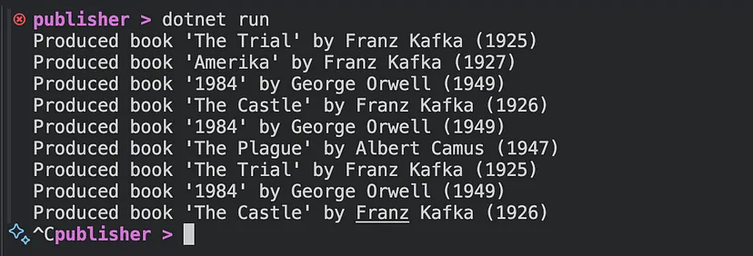
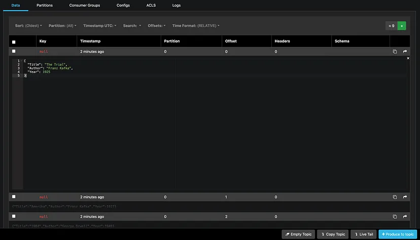
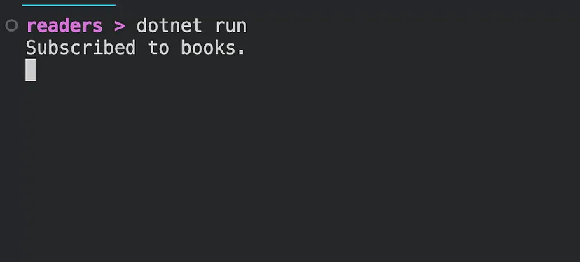
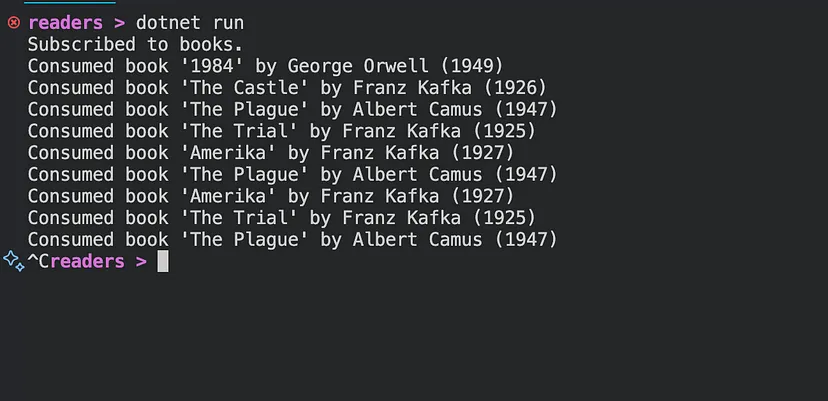
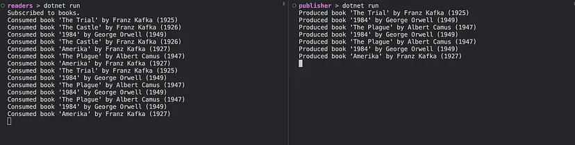

# Kafka with C# and .NET: Getting Started



I was faced with the challenge of working with Kafka using C# and .NET. That turned out pretty challenging because I couldn’t find any sophisticated tutorial. So this article attempts to give you a minimal, but still complete example of implementing both Kafka Producer and Consumer.

## Infrastructure Setup

First, let’s set up the Kafka Server and a management UI. Here’s the very minimal docker-compose to get started (yes, it’s the minimum I was able to get).

```yaml
services:
  akhq:
    image: tchiotludo/akhq
    environment:
      AKHQ_CONFIGURATION: |
        akhq:
          connections:
            docker-kafka-server:
              properties:
                bootstrap.servers: "kafka:9092"
    ports:
      - 8080:8080
    links:
      - kafka
  
  zookeeper:
    image: confluentinc/cp-zookeeper:latest
    restart: always
    environment:
      ZOOKEEPER_CLIENT_PORT: 2181
      ZOOKEEPER_TICK_TIME: 2000
    ports:
      - 22181:2181
  
  kafka:
    image: confluentinc/cp-kafka:latest
    restart: always
    depends_on:
      - zookeeper
    ports:
      - 29092:29092
    environment:
      KAFKA_BROKER_ID: 1
      KAFKA_ZOOKEEPER_CONNECT: zookeeper:2181
      KAFKA_ADVERTISED_LISTENERS: PLAINTEXT://kafka:9092,PLAINTEXT_HOST://localhost:29092
      KAFKA_LISTENER_SECURITY_PROTOCOL_MAP: PLAINTEXT:PLAINTEXT,PLAINTEXT_HOST:PLAINTEXT
      KAFKA_INTER_BROKER_LISTENER_NAME: PLAINTEXT
      KAFKA_OFFSETS_TOPIC_REPLICATION_FACTOR: 1
```

After running

```sh
docker compose up -d
```

You should be able to see an akhq.io management UI on `http://localhost:8080` connected to Kafka instance accessible by port 29092



## Projects Setup

Now, let’s set up our projects folder.

```sh
dotnet new classlib --name books
dotnet new console --name publisher
dotnet new console --name readers

cd publisher
dotnet add package Confluent.Kafka
dotnet add reference ../books

cd ../readers
dotnet add package Confluent.Kafka
dotnet add reference ../books
```

With that setup, we will have both producer (publisher) and consumer (reader) projects reference the message model project (books). Now let’s create the shared model. Plus an util class to get us various messages to produce.

```csharp
public record Book(string Title, string Author, int Year);

public static class Novels {
    public static Book TheTrial = new("The Trial", "Franz Kafka", 1925);
    public static Book TheCastle = new("The Castle", "Franz Kafka", 1926);
    public static Book Amerika = new("Amerika", "Franz Kafka", 1927);
    public static Book NineteenEightyFour = new("1984", "George Orwell", 1949);
    public static Book Plague = new("The Plague", "Albert Camus", 1947);

    public static Book[] All = [TheTrial, TheCastle, Amerika, NineteenEightyFour, Plague];

    public static Book Random() {
        var random = new Random();
        return All[random.Next(All.Length)];
    }
}
```

## Producer

Here’s a complete publisher’s `Program.cs`. This code will intermittently produce a json message with a randomly picked book.

```csharp
using System.Text.Json;
using Confluent.Kafka;

var config = new ProducerConfig { BootstrapServers = "localhost:29092" };
var producer = new ProducerBuilder<Null, string>(config).Build();

while (true) {
    var book = Novels.Random();
    var message = new Message<Null, string> { Value = JsonSerializer.Serialize(book) };
    await producer.ProduceAsync("books", message);
    Console.WriteLine($"Produced book '{book.Title}' by {book.Author} ({book.Year})");
    await Task.Delay(1000);
}
```

You may ask why the consumer is not of `<Null, Book>`. In fact, we can provide a JsonSerializer for the Book. However, using Kafka’s serializer requires providing a SchemaRegistry, which is an overhead for this tutorial (and possibly in general).

Let’s produce a few messages running (Ctrl + C to stop)

```sh
cd publisher
dotnet run
```

You’ll see console messages like that



And you’ll be able to investigate the messages using a management UI



## Consumer

Let’s finish this up by consuming the messages. Here’s the code

```csharp
using System.Text.Json;
using Confluent.Kafka;

var config = new ConsumerConfig { BootstrapServers = "localhost:29092", GroupId = "reader" };
var consumer = new ConsumerBuilder<Null, string>(config).Build();
consumer.Subscribe("books");
Console.WriteLine("Subscribed to books.");

while (true) {
    var consumed = consumer.Consume();
    var book = JsonSerializer.Deserialize<Book>(consumed.Message.Value)!;
    Console.WriteLine($"Consumed book '{book.Title}' by {book.Author} ({book.Year})");
}
```

Start it up in a new window by

```sh
cd consumer
dotnet run
```

For now, it will most likely freeze like



But where you run producer in a separate window it will start to receive the messages like that



## Result

What we got is a small producer-consumer system communicating with each other via Kafka in real-time. Here’s one more example of how it may look

