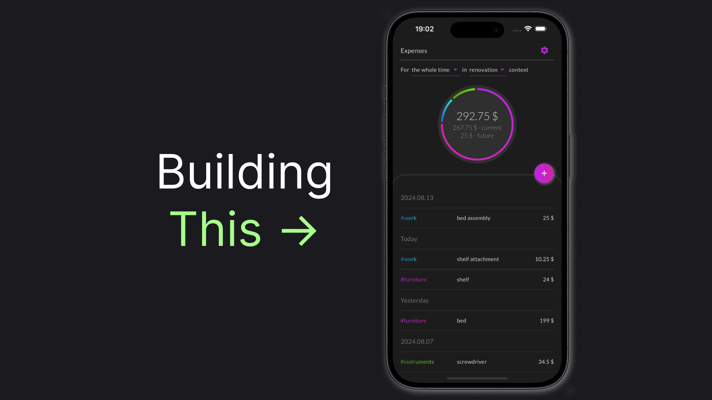

# How I Started My 3-Year Software Development Side Hustle

The app I'm building, called Finrir, recently had a 3rd anniversary: I found that my first commit was on the 22nd of April, 2022. When I started, I wouldn't have believed I could stick with a single project for this long. Similarly, I wouldn’t have believed how much would still be left to do after three years. I decided to reflect on my journey so far. This article will shed light on the first year of it: from idea to me, working on it for 3 hours a day.

> You can check out the [Finrir app in the AppStore](https://apps.apple.com/us/app/finrir/id6472634631).

## How It All Started

The story begins in Abu Dhabi. I've just relocated here and started my new job. Surprisingly enough, what changed for me the most was the amount of free time I received. That happens when you stop spending 4 hours a day on your commute to the office. So it was a design stage of my own time allocation.

I was always dreaming about building my own thing. I even chose software development partially because it is a skill that could allow me to start a "hustle" with __almost__ zero dollars. After some time, I've connected the dots: "I should develop an app!". But what app could a backend developer (like me) build? A Telegram Bot!

I have an old idea in my closet: a personal finance bot. I've already experimented with telegram bots and knew they are technically an http service. That was something I could start developing right ahead. I did understand that telegram bots have a lot of limitations and I probably need to learn how to create a mobile app. Nevertheless, I decided that it's important to just start. My tactic was to develop a sophisticated bot with backend services separated so that I could later connect the mobile app to the core backend services, learning mobile development in parallel. So this was how I started!

## The Long First Steps

I have a long and comical history of trying to become a mobile app developer. I'm probably one of the very few people who learned C# because of a desire to develop a Windows Phone application. Yeah, that was a terrible career choice, but, gladly, my C# skills were still useful for the career of a backend engineer. Anyway, I've spent a lot of time experimenting with both native and cross-platform tools. Eventually, I ended up using Flutter. It just was the best developer experience among everything I've tried, including native development.

However, just to start coding in Flutter seemed to be a bad idea. Mixing up non-existing Flutter skills with a vague vision of what UI should even look like seemed like a recipe for frustration. I needed design. For a person like me at that time that meant learning Figma and UI design basics.

Meanwhile, I was developing backend services, including the one for the telegram bot, various core/shared microservices and the mobile app Backend for the frontend. That all took about a year. Finally, I was ready to say that I have something resembling a functional application.

## The Show Part

It was a time to show it to ~~the world~~ somebody. I wanted to give it to friends and family to play around with. This was the first time I've decided to focus. I decided to show either the mobile app or the telegram bot. I liked the idea that with a telegram bot, I don't have to ask anyone to launch my app, that it will be immediately accessible to everyone, regardless of the platform, and, finally, that it seems that there are fewer things to polish. So I've decided to go with the telegram bot.

I went all-in on polishing the bot, creating proper onboarding, and improving UX. It still surprises me that the 80/20 rule does indeed work. I wasn't really creating something new and innovative, but I think that alone took at least 2 months. Finally, the demo day has come.

I wish I could describe the demo in detail, but my memories of it are vague. I remember part of the time was spent explaining the concept of telegram bots. I also made the bot in English, which doesn't help effectively showcase it to my Russian-speaking family. After all, the demo did highlight that I may have focused on the wrong platform...

## What's Next

The demo day wrapped the first stage of approximately a year of developing the app. I went the road from the idea to showing what I've done to the public. However, I realized I needed to slightly change my product to improve its reach. This started stage/year 2 of my journey, which is a story for another article.

Claps are appreciated to let me know the story is worth continuing. 👏 
