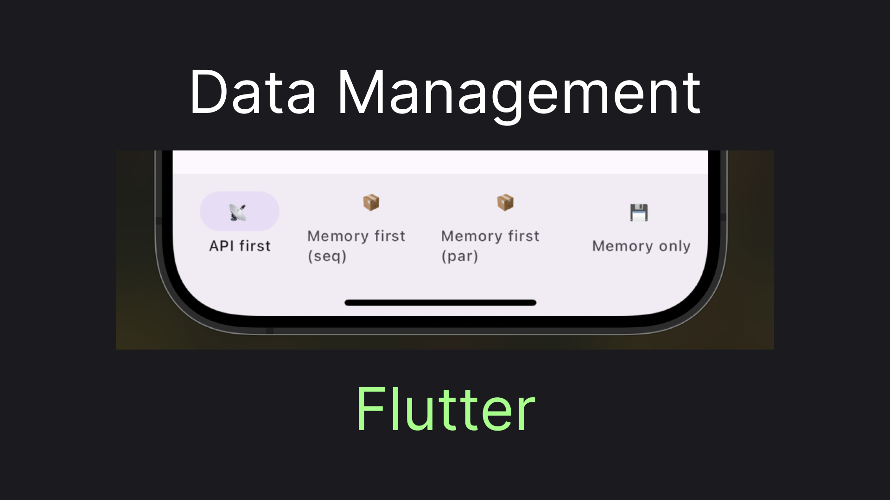
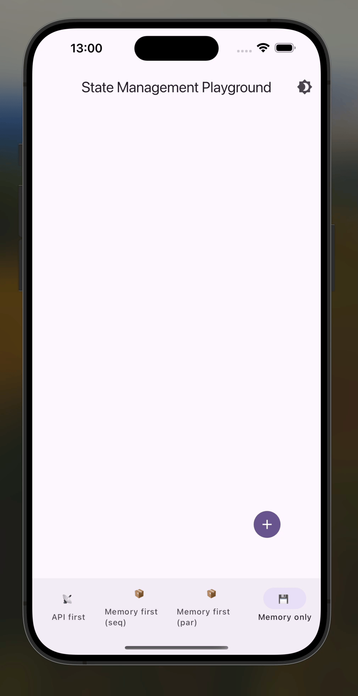
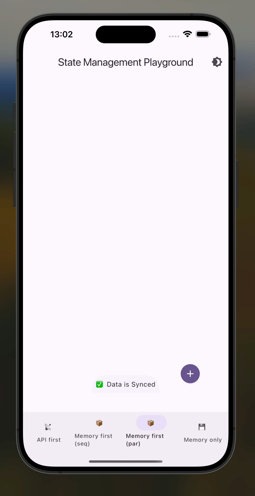
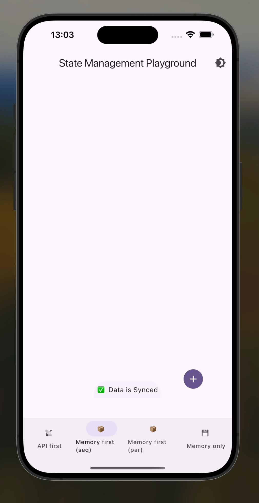
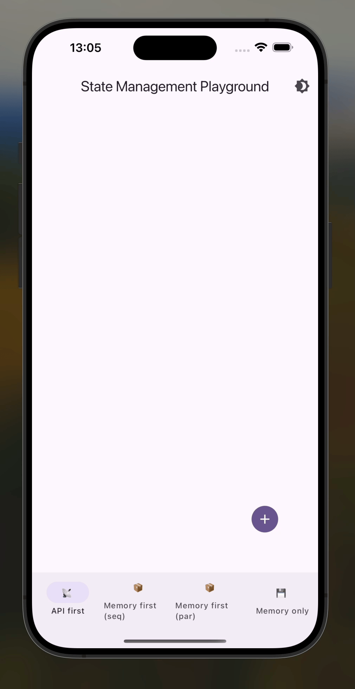

# Flutter Data Management

Practically, any useful Flutter app will communicate with a data store, whether an API, local storage, or something more exotic. When developing [my side project](https://apps.apple.com/us/app/finrir/id6472634631) I've come to a need to architect my widgets and applications layers in a way to support both API-first data management and local storage, with a simple way to switch between the modes. So, I decided to make a small app, serving as an architectural experiment. In this article, I'll share what it came down to.



## The Goal

The app we are going to build should allow us to:

- See a list of items
- Add a new item
- Remove an item

But what's more interesting is that the app should be able to run in multiple "modes", with an ability to switch between those modes without changing anything in the UI. The modes are:

- **Memory-only**, meaning data is just manipulated locally
- **Memory-first**. Where we have a background process syncing data via an API and showing the status of this sync.
- **API-first**. Where the app waits while the changes are applied in the API and only then refreshes the list of items

Let's jump to the code!

## The Fundament

We'll start straight from the most important class in the whole experiment - the `Manager` abstract class. The `Manager` exposes `ValueListenable<List<String>>`, which our UI can listen to display the item list, and the optional `ValueListenable<SyncState>`, used to display the state of background synchronization, when it's applicable. Equally importantly, the `Manager` provides methods for the operation you can do in the app: `add`, `remove`, and `reload` if it's applicable:

```dart
abstract class Manager {
  ValueListenable<List<String>> get collection;
  ValueListenable<SyncState>? get syncStateListenable => null;

  Future<void> add(String item);
  Future<void> remove(String item);
  Future<void> reload() async {}
}
```

You may imagine what `SyncState` look like, but here's my implementation, so that we won't get confused:

```dart
class SyncState {
  bool running;
  Object? unresolvedError;

  SyncState({
    this.running = false,
    this.unresolvedError
  });

  factory SyncState.error(Object error) {
    return SyncState(running: false, unresolvedError: error);
  }

  factory SyncState.inProgress() {
    return SyncState(running: true);
  }

  factory SyncState.done() {
    return SyncState(running: false);
  }
}
```

The abstraction is enough for us to build our UI, so let's do just that!

## The UI

Our root widget will accept a manager, and pass it down to just three app components:

```dart
class Playground extends StatelessWidget {
  final Manager manager;
  
  const Playground({
    super.key,
    required this.manager,
  });

  @override
  Widget build(BuildContext context) {
    return Scaffold(
      body: CollectionListView(manager: manager),
      bottomSheet: manager.syncStateListenable == null ? null : SyncStateBottomSheet(manager: manager),
      floatingActionButton: AddButton(manager: manager)
    );
  }
}
```

The first component, taking most of our app real estate is the `CollectionListView`, which listens to the `manager`s items collection and provides a button, that calls the `manager`s delete operation:

```dart
class CollectionListView extends StatelessWidget {
  final Manager manager;

  const CollectionListView({
    super.key,
    required this.manager,
  });

  @override
  Widget build(BuildContext context) {
    return ValueListenableBuilder(
      valueListenable: manager.collection, 
      builder: (context, items, child) {
        return ListView.builder(
          itemCount: items.length,
          itemBuilder: (context, index) {
            return ListTile(
              title: Text(items[index]),
              trailing: DynamicIconButton(
                onPressed: () => manager.remove(items[index]),
                icon: Icon(Icons.delete)
              )
            );
          }
        );
      }
    );
  }
}

class DynamicIconButton extends StatelessWidget {
  final ValueNotifier<bool> inProgressNotifier = ValueNotifier(false);
  final Future Function() onPressed;
  final Widget icon;

  DynamicIconButton({
    super.key,
    required this.onPressed,
    required this.icon,
  });

  @override
  Widget build(BuildContext context) {
    return ValueListenableBuilder(
      valueListenable: inProgressNotifier,
      builder: (context, inProgress, child) {
        if (inProgress) {
          return CircularProgressIndicator();
        }

        return IconButton(
          icon: icon,
          onPressed: () {
            inProgressNotifier.value = true;
            var future = onPressed();
            future.whenComplete(() {
              inProgressNotifier.value = false;
            });
          },
        );
      }
    );
  }
}
```

The next component is the `AddButton`. What's interesting about it is that it also handles errors, which may occur during the addition and shows an appropriate `SnackBar`:

```dart
class AddButton extends StatefulWidget {
  final Manager manager;

  const AddButton({
    super.key,
    required this.manager,
  });

  @override
  State<AddButton> createState() => _AddButtonState();
}

class _AddButtonState extends State<AddButton> {
  ValueNotifier<bool> addInProgress = ValueNotifier(false);

  @override
  Widget build(BuildContext context) {
    return ValueListenableBuilder(
      valueListenable: addInProgress,
      builder: (ctx, inProgress, child) {
        if (inProgress) {
          return CircularProgressIndicator();
        }
    
        return IconButton.filled(
          icon: Icon(Icons.add),
          onPressed: () {
            addInProgress.value = true;
            var additionFuture = widget.manager.add('Item ${Uuid().v4()}');
            additionFuture.whenComplete(() {
              addInProgress.value = false;
            });
    
            additionFuture.onError((err, stack) {
              ScaffoldMessenger.of(ctx).showSnackBar(
                SnackBar(
                  duration: Duration(milliseconds: 300),
                  behavior: SnackBarBehavior.floating,
                  width: 300,
                  content: Text('Failed to add item'))
                );
            });
          },
        );
      }
    );
  }
}
```

Finally, we have an optional `SyncStateBottomSheet`, that is shown in case our manager provides a `syncStateListenable`. The bottom sheet will also provide a user with the ability to load data from a synchronization target in case we have an error, the code is pretty simple:

```dart
class SyncStateBottomSheet extends StatelessWidget {
  final Manager manager;

  const SyncStateBottomSheet({
    super.key,
    required this.manager,
  });

  @override
  Widget build(BuildContext context) {
    return ValueListenableBuilder(
      valueListenable: manager.syncStateListenable!, 
      builder: (context, syncState, child) {
        if (syncState.running) {
          return Container(
            padding: EdgeInsets.all(8),
            child: Text('⏳ Syncing Data')
          );
        }
    
        if (syncState.unresolvedError != null) {
          return Container(
            padding: EdgeInsets.all(8),
            child: TextButton(
              child: Text('❌ Sync Error, tap to reload'),
              onPressed: () {
                manager.reload();
              }
            )
          );
        }
    
        return Container(
          padding: EdgeInsets.all(8),
          child: Text('✅ Data is Synced')
        );
      }
    );
  }
}
```

Setting up the UI is fun, but what's even more fun is seeing it in action, for that we'll need to implement a real manager. Let's get to that!

## Memory-Only Manager

The first manager implementation will be the simplest one: just doing the operation in memory.

```dart
class MemoryOnlyManager extends Manager {
  final ObservableCollection<String> _collection = ObservableCollection();

  @override
  ValueListenable<List<String>> get collection => _collection;

  @override
  Future<void> add(String item) async {
    _collection.add(item);
  }
  
  @override
  Future<void> remove(String item) async {
    _collection.remove(item);
  }
}
```

The class just utilized `ObservableCollection`, which is a very simple wrapper over a normal `List<T>`:

```dart
class ObservableCollection<T> extends ChangeNotifier implements ValueListenable<List<T>> {
  List<T> _items = [];

  @override
  List<T> get value => _items;

  void add(T item) {
    _items.add(item);
    notifyListeners();
  }

  void remove(T item) {
    _items.remove(item);
    notifyListeners();
  }

  void reset(List<T> items) {
    _items = items.toList();
    notifyListeners();
  }
}
```

Here's what the UI looks like with our first manager implementation:



Now let's do something more interesting!

## Memory-First Manager

The next manager will have a background synchronization with an API. It will also utilize `ObservableCollection` and first apply changes to it, but in addition to that it will add a synchronization action matching the performed action:

```dart
class MemoryFirstManager extends Manager {
  SyncController syncController;
  ApiEmulator api;

  MemoryFirstManager({
    required this.syncController,
    required this.api
  });

  final ObservableCollection<String> _collection = ObservableCollection();

  @override
  ObservableCollection<String> get collection => _collection;

  @override
  Future<void> add(String item) async {
    _collection.add(item);
    syncController.add(() => api.post(item));
  }
  
  @override
  ValueListenable<SyncState>? get syncStateListenable => syncController;
  
  @override
  Future<void> remove(String item) async {
    _collection.remove(item);
    syncController.add(() => api.delete(item));
  }

  @override
  Future<void> reload() async {
    syncController.reset(() async {
      final items = await api.get();
      _collection.reset(items);
    });
  }
}
```

You may notice, that it utilizes an `ApiEmulator` as a target of synchronization operations. The emulator is nothing special, just a wrapper over `List<String>` that delays before completing operations and sometimes throws errors:

```dart
class ApiEmulator {
  final List<String> items = [];

  Duration delay;
  final int failsOnceIn;

  ApiEmulator({
    this.delay = const Duration(milliseconds: 300),
    this.failsOnceIn = 3
 });

  Future<void> post(String item) async {
    print('posting $item');
    await Future.delayed(delay);
    if (DateTime.now().millisecond % failsOnceIn == 0) {
      throw Exception('Failed to post $item');
    }

    print('recording item to api emulator storage. expected to have ${items.length + 1} items');
    items.add(item);
    print('posted $item, items count: ${items.length}');
  }

  Future<void> delete(String item) async {
    print('deleting $item');
    await Future.delayed(delay);
    items.remove(item);
    print('deleted $item');
  }

  Future<List<String>> get() async {
    await Future.delayed(delay);
    print('returning items. items count:  ${items.length}');
    return items;
  }
}
```

The more interesting class is the `SyncController`, which in reality is an interface:

```dart
abstract class SyncController implements ValueListenable<SyncState> {
  void add(Future Function() action);
  void reset(Future Function() action);
}
```

So to see the `MemoryFirstController` in action we first need to implement the `SyncController`. In the first version we'll just trigger the future as soon as it is added to the "queue", we'll call it `ParallelSyncController`:

```dart
class ParallelSyncController extends ChangeNotifier implements SyncController {
  final List<Future> futures = [];
  Object? unresolvedError;
  
  @override
  void add(Future Function() action) {
    var future = action();
    futures.add(future);

    if (futures.length == 1) {
      notifyListeners();
    }

    future.then(
      (_) {
        futures.remove(future);
        if (futures.isEmpty) {
          notifyListeners();
        }
      },
      onError: (err, stack) {
        futures.remove(future);
        unresolvedError = err;
        notifyListeners();
      }
    );
  }
  
  @override
  void reset(Future Function() action) {
    unresolvedError = null;
    Future.wait(futures).then(
      (value) {
        add(action);
        notifyListeners();
      }
    );
  }
  
  @override
  SyncState get value => SyncState(
    running: futures.isNotEmpty,
    unresolvedError: unresolvedError
  );
}
```

And this is what our UI will look like with this implementation:



The implementation is relatively simple and works pretty good. However, in a real-world app data is frequently inter-connected, so the operations need to be done in the order, in which they occur. That's why we have another `SyncController` implementation:

```dart
class SequentialSyncController extends ChangeNotifier implements SyncController {
  final List<Future Function()> _futures = [];
  Object? _unresolvedError;

  @override
  void reset(Future Function() futureFactory) {
    _futures.clear();
    _unresolvedError = null;
    add(futureFactory);
  }

  @override
  void add(Future Function() futureFactory) {
    _futures.add(futureFactory);

    if (_futures.length == 1) {
      processToNext();
      notifyListeners();
    }
  }

  void processToNext() {
    var factory = _futures.first;
    var future = factory();

    future.then(
      (_) {
        _futures.removeAt(0);
        if (_futures.isNotEmpty) {
          processToNext();
        } else {
          notifyListeners();
        }
      },
      onError: (err, stack) {
        _futures.clear();
        _unresolvedError = err;

        notifyListeners();
      }
    );
  }
  
  @override
  SyncState get value {
    print('returning value to the listenable');

    if (_unresolvedError != null) {
      return SyncState.error(_unresolvedError!);
    }

    return _futures.isNotEmpty ? SyncState.inProgress() : SyncState.done();
  }
}
```

With that synchronization technique we'll have a slightly slower synchronization, which, nevertheless, may be the only option:



The memory first scenario is pretty complicated, so the last scenario we are going to cover in this article should feel like a relief.

## API-First Manager

In the last implementation, we'll just call the appropriate API method and then "fetch" up-to-date data from the API. Here's the code:

```dart
class ApiFirstManager extends Manager {
  final ApiEmulator api;
  final ObservableCollection<String> _collection = ObservableCollection<String>();

  @override
  ValueListenable<List<String>> get collection => _collection;

  ApiFirstManager({ required this.api }) {
    _collection.reset(api.items);
  }

  @override
  Future<void> add(String item) async {
    await api.post(item);
    await reload();
  }
  
  @override
  Future<void> remove(String item) async {
    await api.delete(item);
    await reload();
  }
  
  @override
  Future<void> reload() async {
    final items = await api.get();
    _collection.reset(items);
  }
}
```

This time visual behaviour will vastly vary, with operation buttons locking on every operation waiting for completion of the tasks triggered on the `Manager`:



The mode is the last thing I want to show you in this article, so let me just finish this up with a few final words.

## Wrapping Up

The article gives you my take on implementing multi-scenario data management for a Flutter app. It introduces a `Manager` pattern, with the manager controlling the application data flow. The approach seems a bit green for me and I would like to hear your thoughts in the comments below and ... claps are also appreciated 👉👈
