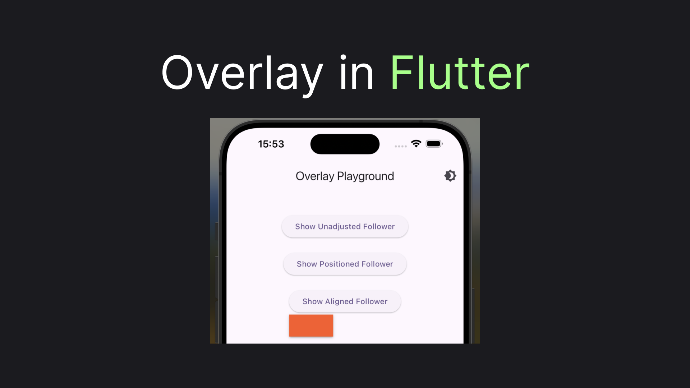
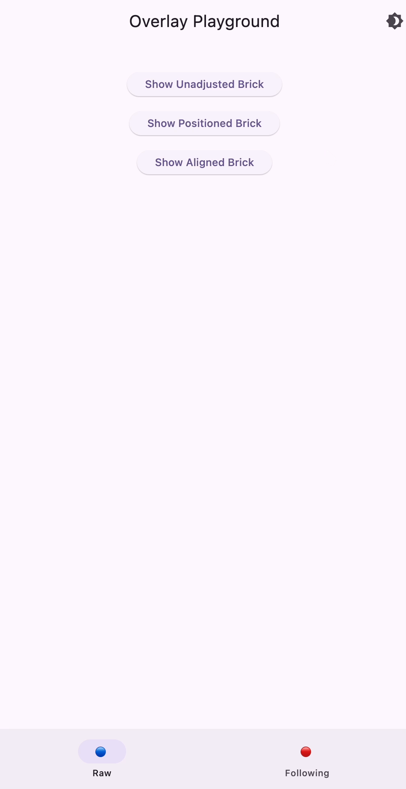
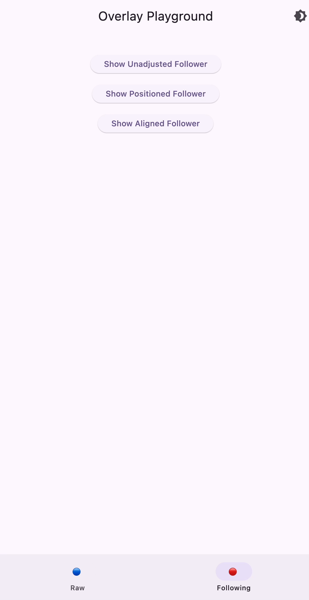

# Flutter Overlay: Getting Started + CompositedTransformFollower

`Overlay` is a pretty fundamental Flutter widget, used internally in many other popular widgets like `DropdownMenu`. Yet there's very little information about it on the internet. This article will show you how to use the widget, plus provide you insights on how to make the widget even more useful with widgets that get, undeservedly, even less attention: `CompositedTransformFollower` and `CompositedTransformTarget`. Let's jump to the code!



## Showing the Brick

Well, an `Overlay` should display a child widget over the remaining of the UI, so let's first get ourselves something to display. We'll have a colorful container, with hard-coded size and shadow just for aesthetics. We'll call it Brick for brevity:

```dart
class Brick extends StatelessWidget {
  @override
  Widget build(BuildContext context) {
    return Container(
      width: 80,
      height: 40,
      decoration: BoxDecoration(
        color: Colors.deepOrange,
        boxShadow: kElevationToShadow[2]
      ),
    );
  }
}
```

Now let's create a button that when pressed will build an `OverlayEntry` with a `Brick` and display it for one second:

```dart
class ShowBrickButton extends StatelessWidget {
  final Widget Function(Widget brick) adjustBrick;
  final String adjustmentLabel;

  const ShowBrickButton({
    required this.adjustBrick,
    required this.adjustmentLabel
  });

  @override
  Widget build(BuildContext context) {
    return ElevatedButton(
      onPressed: () async {
        var entry = OverlayEntry(builder: (context) => adjustBrick(Brick()));

        Overlay.of(context).insert(entry);
        await Future.delayed(Duration(seconds: 1));
        entry.remove();
      },
      child: Text('Show $adjustmentLabel Brick'),
    );
  }
}
```

You may notice that instead of just creating a `Brick` in the `OverlayEntry` we pass it to the `adjustBrick` so that we can do some additional manipulations with it. For the beginning let's not do anything with the `Brick`:

```dart
ShowBrickButton(
    adjustBrick: (brick) => brick,
    adjustmentLabel: 'Unadjusted'
),
```

Let's see what we got:


Surprisingly, this ignores our `Brick` dimensions and expands this to the whole screen. Let's do something about it!

## Giving Constraints

To prevent our brick from taking up the whole screen we will need to wrap it in some widget constraining its positioning. Probably the most popular widget to achieve this is the `Positioned` widget. To my surprise `Positioned` not just provide offsets, but also have `height` and `width` properties. Let's utilize them:

```dart
ShowBrickButton(
    adjustBrick: (brick) => Positioned(height: 150, width: 150, child: brick),
    adjustmentLabel: 'Positioned'
),
```

This will give us:



As you may see the solution still pretty much ignores the brick's own dimensions, but limits it to the sizes supplied via the `Positioned` widget. Gladly, there is a widget that will allow us to use the `width` and `height` we have for the Container.

```dart
ShowBrickButton(
    adjustBrick: (brick) => Align(child: brick),
    adjustmentLabel: 'Aligned'
),
```

With the use of the `Align` widget we'll have our correctly sized brick displayed in the middle of the screen:


So far so good, but for a real-world scenario we probably don't just need to show overlays in some arbitrary position on the screen, but rather show it relative to another widget. That's what we will do next!

## Following Widgets

To bind two widgets positioning in Flutter we have `CompositedTransformTarget` and `CompositedTransformFollower` widgets. By using `LayerLink`, connected to `CompositedTransformTarget` `CompositedTransformFollower` can be drawn relative to it's target. Let's create a new widget, based on our previously defined`ShowBrickButton`. All we will essentially do is wrap `ElevatedButton` in `CompositedTransformTarget`, and `Brick` in `CompositedTransformFollower`. Here's the code we'll end up with:

```dart
class ShowFollowerButton extends StatelessWidget {
  final LayerLink layerLink = LayerLink();
  final Widget Function(CompositedTransformFollower follower) adjustFollower;
  final String adjustmentLabel;

  ShowFollowerButton({
    required this.adjustmentLabel,
    required this.adjustFollower
  });

  @override
  Widget build(BuildContext context) {
    return CompositedTransformTarget(
      link: layerLink,
      child: ElevatedButton(
        onPressed: () async {
          var follower = CompositedTransformFollower(
            link: layerLink,
            targetAnchor: Alignment.bottomLeft,
            child: Brick()
          );

          var entry = OverlayEntry(builder: (context) => adjustFollower(follower));

          Overlay.of(context).insert(entry);
          Future.delayed(Duration(seconds: 1), () => entry.remove());
        }, 
        child: Text('Show $adjustmentLabel Follower'),
      )
    );
  }
}
```

As before starting with the unadjusted button

```dart
ShowFollowerButton(
  adjustmentLabel: 'Unadjusted',
  adjustFollower: (follower) => follower
),
```

we'll get:


Although now the brick doesn't occupy the whole screen it's still expanded beyond its dimensions. Gladly, we already know what to do with it.

## Adjusting the Follower

Let's first check out how it will look, wrapped in a `Positioned` widget

```dart
ShowFollowerButton(
  adjustmentLabel: 'Positioned',
  adjustFollower: (follower) => Positioned(height: 100, width: 100, child: follower)
),
```

Expectedly we'll get our brick below the button, stretched to the positioned dimensions:


Finally, let's use the `Align` widget, which helped us before:

```dart
ShowFollowerButton(
  adjustmentLabel: 'Aligned',
  adjustFollower: (follower) => Align(child: follower)
),
```

And get us the following `Brick` with its real dimensions:


This looks good and gives us enough fundamentals of what `Overlay` is about. So, let's wrap it here!

## Wrapping Up!

I hope that article brings `Overlay` to your arsenal to build some exciting UIs in Flutter. A combination of `CompositedTransformTarget`, `CompositedTransformFollower`, and `Align` should be enough to build real-life application widgets, such as dropdowns or hints. And if this article was helpful ... I would appreciate some claps! 😉

You can play around with the code from this article, by cloning [this repository](https://github.com/astorDev/fanci). And here's a gif, showing everything we've built throughout this article:



