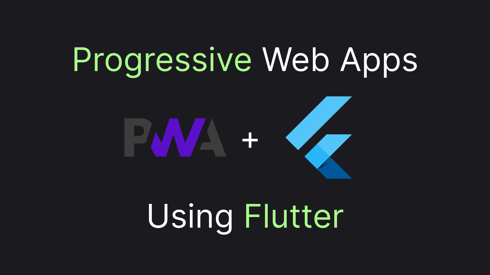

# PWA with Flutter

Progressive Web Apps (PWA) are a great way to take back control over your mobile app distribution. Due to my recent [struggle with AppStore](https://medium.com/p/0208e7b945e7) now I'm pivoting more towards a web-first approach for my mobile app distribution. The app is built using Flutter, so I've spent the last couple of days investigating how well Flutter plays with PWAs and now I'm ready to share my findings in this article!



## Deploy First

There's nothing special required to instantiate a Flutter app to work with Firebase, all we need to run is

```sh
flutter create .
```

Since PWA requires https to function properly we'll need to deploy our app. A free and probably the simplest way to do this is using Firebase. Here are the steps to do it:

1. Go to the [Fireblocks Console](https://console.firebase.google.com/u/0/) and create a free account.
2. Create a new project there:
    1. Pick a name for the project
    2. Choose if you want to enable Google Analytics. Doing it is optional and out of the scope of this article.
3. Install Firebase CLI tools

```sh 
npm install -g firebase-tools
```

4. Login into Firebase

```sh
firebase login
```

5. Init Firebase in your Flutter project folder. This will ask which project you want to reference and add the required files to the project folder.

```sh
firebase init
```

6. Build the Flutter project:

```sh
flutter build web
```

7. Finally deploy the app:

```sh
firebase deploy
```

Fireblocks CLI tools will show you a url where you can reach your deployed application. If you follow the url in Chrome you will see an icon, suggesting the installation of the app:


Congratulations, your PWA is ready! Now, let's do something interesting with it!

## Data

One of the most important features of a PWA is local data storage, which also enables a PWA to work offline. Perhaps one of the most popular choices for data storage is Flutter is [Hive](https://github.com/isar/hive?ysclid=m2eps9q6xe924233605). Gladly, the library does support the web! But their readme installation won't work on the web, let me share with you an alternative that will!

First, we'll need to create two dependencies, where `hive_flutter` will give us an installation utility method, working on the web:

```yaml
dependencies:
  hive: ^2.2.3
  hive_flutter: ^1.1.0
```

With the dependencies installed, we can start using the library in our app:

```dart
void main() async {
    // The method will execute a platform-aware setup of Hive
    await Hive.initFlutter();
    
    // open a box and start using it!
    var box = await Hive.openBox('myBox');

    // use the box a way you want.

    runApp(const MyApp());
}
```

Now let's discuss the last bit of PWAs - offline mode!

## Offline Mode

There doesn't seem to be any official information about offline mode workability for Flutter apps. There's an open [github issue](https://github.com/flutter/flutter/issues/60069) asking for offline support. It seemed like offline mode is **not** supported yet or requires an additional modification. However, my experiments showed that offline mode workability depends on the platform I tried to install the PWA and the workarounds proposed in the issue don't affect workability. Here's a table summarizing my findings

| PWA Platform      | Workability   |
| ----------------- | ------------- |
| iOS (Safari)      | Don't work    |
| Android (Chrome)  | Works         |
| macOS (Chrome)    | Somewhat work |

> "Somewhat work" means that I get unstable results on the platform

And this is the last thing I have about PWA in Flutter. Let's do a quick recap and call it an article!

## Recap

Flutter comes with great built-in support for PWA and the `hive` data storage library is shipped with web support, too. Although there are yet some troubles with iOS (as always) my experiment results are pretty satisfying ... and one more thing, claps are appreciated 👏
