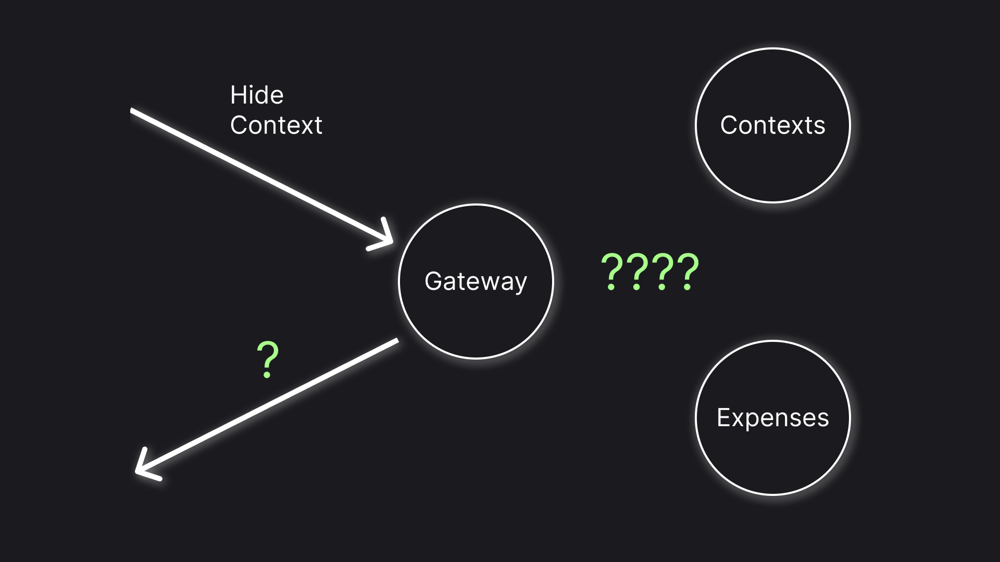

# Microservice Architecture Case Study: Hidden Category

Developing [my side project](https://apps.apple.com/us/app/finrir/id6472634631) I've bumped into an interesting challenge, relating to data synchronization in microservices. In short, I want to mark a category as hidden, simultaneously hiding items in a category from an unfiltered list. The challenge seems to be pretty common, still having practised microservices for a few years I couldn't find a standard solution. Here I will share some different options and my thoughts on them, finishing with the decision I've finally made. If that sounds interesting let me give you details of the problem first.



## The Problem

The Finrir app, in which the challenge occurs, allows a user to track expenses. For better organization, the app has a thing called **Contexts**, which is essentially a folder for expenses. The app talks to a Gateway, which talks to other microservices, in this particular case the microservices we are interested in are **Contexts** and **Expenses** microservices. **Contexts** microservice stores a list of user contexts and their configuration, **Expenses** microservice stores various data about an expense, including a reference to a context to which the expense belongs.

The goal is to architect the handling of a "Hide Context" command. When a context is hidden it will not appear in the filter dropdown and, more interestingly, expenses from the context are not shown anywhere e.g. if a user picks "any" for contexts filter expenses from hidden contexts are still excluded from the list.

Here's a very simplified pseudocode of how this would work if it were an in-memory system.

```ruby
hideContext
    theContext = contexts.by @contextId
    theContext.hidden = true

allContexts
    return contexts.where =>
        @context.hidden != true

allExpenses
    return expenses.where => 
        @expense.context.hidden != true
```

The root problem of the challenge is that the **expenses** microservice does not (and probably shouldn't) know if the context is hidden or not. The article will not discuss whether the list of services is correct - though I'm open for discussion in the comments. Other than that, we can architect the system however we want. Let me share with you the options I've come up with!

> "Just use a Saga! 🤓"
> 
> Unfortunately, that alone doesn't solve anything. Things I say about every option below are as applicable to saga steps as it is to procedural calls. It may change the complexity difference, though. So your final choice may easily be different than mine.

## Option 1. Gateway Filtering

The first option is to not store the hidden flag on expenses at all. Instead, if the expenses query doesn't filter them on a specific context do a cleanup in a gateway: get hidden contexts from contexts service and exclude expenses belonging to those services. Here's how the option looks in pseudocode:

```ruby
Gateway
    hideContext
        contextsService.patch @context hidden:true
    
    getExpenses
        expenses = _expensesService.get @request.query

        if @request.query.context == null
            hiddenContexts = contextsService.get @userId hidden:true
            expenses = expenses.excluding =>
                hiddenContexts.contains @expense
        
        return expenses
```

Although this option is pretty straightforward, there are quite a few pitfalls in this approach. But let me start with what I like about it:

**Benefits:**

1. _Data Consistency Guarantee_. Since we don't need to synchronize data in any distributed storage we get a level of data consistency we'll if that would be a single service
1. _Fast update_. As there's an absolute minimum of operations in `hideContext` we'll get the fastest possible update.

**Drawbacks:**

1. _Slow read_. With this approach, we accept both reading expenses that will not end up in a result and doing a roundtrip to contexts service to fetch hidden contexts. This is a big overhead, especially knowing that in the app the read operation is way more common than the update operation, the performance of which we can avoid caring too much about. 
1. _Explicit orchestration_. This problem is present for every option with the word `Gateway` in it. Let me first explain what I mean by "orchestration". My informal definition would be: ensuring that the data distributed among services is adequately represented i.e. expenses are hidden when parent context is marked hidden. When the orchestration is done explicitly i.e. by a particular service we fall into the risk of the service becoming too big, which seems quite contrary to the whole idea of creating microservices.
1. _Overinformed read_. This is closely related to explicit orchestration. In this case "read" operation has an implicit dependency on the "update" operation. Keeping in mind, that we talk about "read" and "update" operations of different entities (contexts and expenses) you probably can see how such dependency could result in a maintenance nightmare.

Although the option solves the root problem of the issue (data inconsistency) it brings a whole set of other unpleasant problems. Let's see what we'll get if we were to pick a more direct approach.

## Option 2. Unchecked Sequential Actions In the Gateway

So how about we just update expenses after updating the context, just call the two services one by one? Something like this:

```ruby
Gateway
    hideContexts
        contextsService.patch @userId @context hidden:true
        expensesService.patch
            by 
                context = @context
            set
                hidden = true
```

I assume if you are experienced in microservices you already see the main problem with that. If the second operation fails we'll have an inconsistent state: context is hidden, but the expenses in it are visible. But more on that later, let's start with something more optimistic.

**Benefits:**

1. _Straightforwardness_. I just couldn't think of any more obvious way to achieve the result. It's simple to write, simple to understand, and simple to reason about.
1. _Fast read_. We don't even touch the read operation in this case, so it's the simplest possible read - just read all expenses without the hidden flag.

**Drawbacks:**

1. _Potential data inconsistency_. This is the problem I've talked about before. If the second operation fails, we'll have an inconsistent state: context is hidden, but the expenses in it are visible. 
1. _Slow update_. We'll now do virtually everything in the update section, which obviously increases the amount of resources we need to execute the operation.
1. _Explicit orchestration_.

The good news, about data inconsistency is that it's not that critical. A user will see an error occurring so the inconsistency will be at least somewhat expected and the user can restore the adequate state by switching the hidden toggle on and off, in other words, the idempotency of the operation makes data inconsistency not that terrible. But that's the thing about microservices: we lose atomicity, which we took for granted in the good old monolith. Let's find out what we can do about it.

## Option 3. Sequential Actions With Compensation In the Gateway

Well, the first, easy thing that comes to mind is to perform a compensation action. Meaning if we weren't able to update expenses before returning an error also update the context to be visible again. Something along those lines:

```ruby
Gateway
    hideContexts
        contextsService.patch @userId @context hidden:true
        try
            expensesService.patch
                by 
                    context = @context
                set
                    hidden = true
        catch
            contextsService.patch @context hidden:false
            throw
```

**Benefits:**

1. _Lowered data inconsistency risk_. This is the point of this option. In the scenario when the expenses update fails we restore a valid state (like it was before the operation).
1. _Relatively straightforward_. Although this option is slightly more complicated it's still relatively easy to comprehend. 
1. _Fast read_. 

**Drawbacks:**

1. _Still potential data inconsistency_. Compensations being a solution to "in case it fails" has an obvious risk of, "but what if the compensation fails". Although the risk of two independent services failing is much lower it's still surely possible if there's for example an internet connection problem.
1. _Explicit orchestration_.
1. _Slow update_.

Although the option seems to be more stable it's not an ultimate solution. Let's try something more extravagant!

## Option 4. Sequential Actions With Filtering In the Gateway

We have late filtering, that guarantees data consistency but comes with a performance hit. At the same time, we have caught an update, that is relatively fast but is not certain. How about we do the late filtering **only** if we know that there was an error? This might look something like this:

```ruby
Gateway
    hideContexts
        contextsService.patch @userId @context hidden:true
        try
            expensesService.patch
                by 
                    context = @context
                set
                    hidden = true
        catch
            errors.add @userId 'contextHiding' @context

    getExpenses
        expenses = _expensesService.get @request.query

        if @request.query.context == null
            if errors.has @userId 'contextHiding'
                hiddenContexts = contextsService.get @userId hidden:true
                expenses = expenses.excluding =>
                    hiddenContexts.contains @expense
        
        return expenses
```

> We can also try patching the expenses if an error is present, before executing the filtering (so that error is not present the next time)

**Benefits:**

1. _Supposed data consistency_. If we are able to implement the error storage that approach doesn't seem to have a path to data inconsistency
1. _Positive feedback_. In case the second operation fails, it will be not visible to a user, we'll just handle the error under the hood.
1. _Relatively fast read_. For happy flow, the overhead would be roughly equal to the time we need to check if an error exists. If the error storage will be implemented to be fast the overhead shouldn't be too big.

**Drawbacks:**

1. _Need for the complicated error storage_. Note how every benefit started with "if". This is because we'll need the error storage to be distributed as well. So implementing it will probably be a great challenge on its own.
1. _Slow update_. 
1. _Explicit Orchestration_.
1. _Overinformed read_.

I have very mixed feelings about this solution. It sort of solves all technical challenges, but it screams over-engineering. Although I can think of ways to make it even more sophisticated it's already beyond complexity I'll be ready to put in a real system. So let's not go deeper on that path and instead pivot our brainstorming a little bit.

## Option 5. Untracked Events

Options 1 - 4 all have explicit orchestration as a drawback. But what's the alternative? Well, we can implement an implicit orchestration via events. The Gateway service will know nothing about the need to update expenses, but the expenses service will receive events about contexts being hidden and update its records accordingly:

```ruby
Gateway
    hideContexts
        contextsService.patch @userId @context hidden:true

Contexts
    patchContexts
        updatedContext = db.contexts.update @contextId hidden:true
        bus.publish contextHiddenEvent

Expenses
    onContextHiddenEvent
        db.update
            by =
                context = @context
            set =
                hidden = true
```

**Benefits:**

1. _Fast read_. Reading doesn't receive any overhead
1. _Fast update_. The update stays as tiny as possible, too
1. _Implicit Orchestration_. In this configuration, the Gateway service controls nothing about the dependency between data of the services.

**Drawbacks:**

1. _Data inconsistency_. Publishing and handling events take time (in the background). Therefore, if read expenses request in send right after the hide contexts command it's virtually guaranteed to get an invalid result.
1. _Hidden problems_. Unlike in sequential calls approach if the second operation fails user will not just get inconsistent results, but also have no idea something wrong even happened.

Although the benefits of this approach are great the price seems unbearable. Let's check out one more fancy idea of overcoming the problem and call it an article.

## Option 6. Events With Filtering In the Gateway

Well, the root problem of the previous approach is that Gateway service knows nothing about data synchronization and its status, and thus can not save users from data inconsistencies. How about we wait for a message indicating that data synchronization is complete and do the protective late filtering for our users before the synchronization is complete? It should go like this:

```ruby
Gateway
    hideContexts
        contextsService.patch @userId @context hidden:true @traceId
        awaitedOperations.add 'contextHiding' @userId @traceId
        
    onExpensesUpdated
        awaitedOperations.remove @traceId

    getExpenses
        expenses = _expensesService.get @request.query

        if @request.query.context == null
            if awaitedOperations.has 'contextHiding' @userId
                hiddenContexts = contextsService.get @userId hidden:true
                expenses = expenses.excluding =>
                    hiddenContexts.contains @expense
        
        return expenses

Contexts
    patchContexts
        updatedContext = db.contexts.update @contextId hidden:true
        bus.publish contextHiddenEvent @traceId

Expenses
    onContextHiddenEvent
        db.update
            by = context:@context
            set = hidden:true
        bus.publish expensesUpdated @traceId     
```

**Benefits:**

1. _Supposed data consistency_.
1. _Relatively fast read_.
1. _Relatively fast update_.

**Drawbacks:**

1. _Need for a complicated awaited operations storage_.
1. _Semi-explicit orchesration_. Why the "semi", how is it different from all the other orchestrations? Well, unlike in other explicit orchestrations removing the orchestrator will not make the system unusable, instead, we sort of degrade to option 6.
1. _Overinformed read_. With all said above, it is worth mentioning that this option produces a lot of tricky dependencies.

This was the last option. I feel like that covers at least the main options I can come up with. Now, how about I give you my final take on the options?

## What Option Did I Choose?

I've decided to go with [option 2](#option-2-unchecked-sequential-actions-in-gateway) (unchecked sequential actions in the gateway). That approach requires the least effort and although it may produce data inconsistency, that inconsistency is: a. Anticipated, b. Repairable. In other words, for a corner case asking a user to toggle the hidden toggle back and forth doesn't seem like too high a price, provided that the user will see that some error has occurred. 

Regarding the danger of Gateway becoming "too big", I'm **indeed** not happy about the solution from this perspective. However, my experience tells me that making a decision, based primarily on a thing that **may** happen is the dominant reason for over-engineering, it is sort of a premature optimization of architecture. So the thing I tell myself on "it may become too big!" is "yes, but it may not!".

If you would take a different path I would be happy to discuss it in the comments! And, as always, claps are appreciated! 👏 
